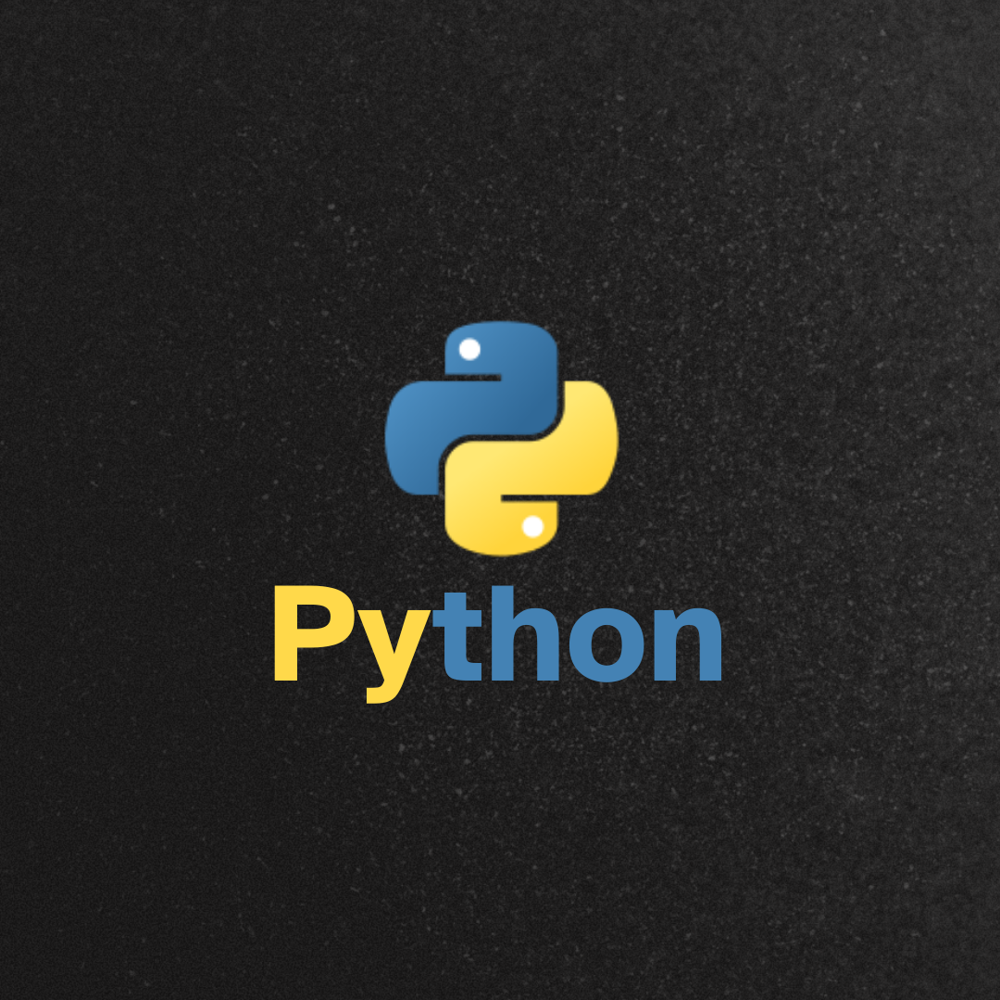
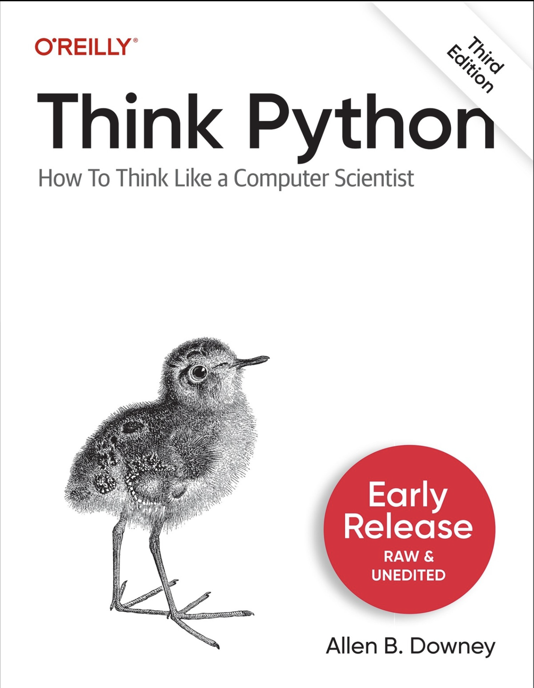

# Python Roadmap and E-Book Repository

Welcome to the **Python Roadmap and E-Book Repository**! 🎉

This repository is your one-stop destination for all resources, study materials, and projects related to becoming a Python developer. Whether you're a beginner or looking to master advanced concepts, you'll find valuable content here.

---

## What's Inside?

- **Python Roadmap**: A comprehensive guide to help you navigate your journey from beginner to master in Python.
- **E-Books**: Downloadable PDFs like:
  - `Python_Roadmap_Beginner_to_Master.pdf`
  - `python-e-book.pdf`
- **Projects**: Hands-on projects to apply your Python skills and build a strong portfolio.

---

## Full "Think Python" E-Book

We have included the full **"Think Python" (3rd Edition)** eBook in this repository. This book is an excellent resource for learning Python programming from the ground up.

- **File Name**: `Think-python-book-3rd-edition.pdf`
- **How to Access**: Download the PDF directly from this repository and start learning!

---

## How to Use This Repository?

1. Browse the repository to explore the available resources.
2. Download any PDF to start learning.
3. Use the roadmap to structure your learning path.
4. Work on the projects to gain practical experience.

---

## Contribution

Feel free to contribute by adding more resources, e-books, or projects to help the Python developer community grow!

Happy Learning! 🚀

#

👉🏻 External open surce repo link

# Simple-Python-Mini-Projects

These mini projects showcase Python's versatility in practical applications, covering fundamental programming concepts such as calculations, data manipulation, and interactive interfaces. From utilities like converters and calculators to interactive games and trackers, each project emphasizes Python's capability for both learning and real-world application development.

## Python Mini Projects

This repository contains a collection of Python mini projects. Below is a list of the projects included:

| **No.** | **Name**                                                                                                                                                                  |
| ------- | ------------------------------------------------------------------------------------------------------------------------------------------------------------------------- |
| **01**  | **[ATM Simulator](https://github.com/ShravanDalavi/Simple-Python-Mini-Projects/tree/main/ATM%20Simulator)**                                                               |
| **02**  | **[Alarm Clock](https://github.com/ShravanDalavi/Simple-Python-Mini-Projects/tree/main/Alarm%20Clock)**                                                                   |
| **03**  | **[BMI_calulator](https://github.com/ShravanDalavi/Simple-Python-Mini-Projects/tree/main/BMI_calulator)**                                                                 |
| **04**  | **[Binary-Decimal Converter](https://github.com/ShravanDalavi/Simple-Python-Mini-Projects/tree/main/Binary-Decimal%20Converter)**                                         |
| **05**  | **[Blood Bank Management System](https://github.com/ShravanDalavi/Simple-Python-Mini-Projects/tree/main/Blood%20Bank%20Management%20System)**                             |
| **06**  | **[Calculator](https://github.com/ShravanDalavi/Simple-Python-Mini-Projects/tree/main/Calculator)**                                                                       |
| **07**  | **[Chess Game](https://github.com/ShravanDalavi/Simple-Python-Mini-Projects/tree/main/Chess%20Game)**                                                                     |
| **08**  | **[Countdown timer](https://github.com/ShravanDalavi/Simple-Python-Mini-Projects/tree/main/Countdown%20timer)**                                                           |
| **09**  | **[Digital White Board](https://github.com/ShravanDalavi/Simple-Python-Mini-Projects/tree/main/Digital%20White%20Board)**                                                 |
| **10**  | **[Get IP address and Hostname of Website](https://github.com/ShravanDalavi/Simple-Python-Mini-Projects/tree/main/Get%20IP%20address%20and%20Hostname%20of%20Website)**   |
| **11**  | **[Grocery Store Management System](https://github.com/ShravanDalavi/Simple-Python-Mini-Projects/tree/main/Grocery%20Store%20Management%20System)**                       |
| **12**  | **[Habit Tracker with Data Visualization](https://github.com/ShravanDalavi/Simple-Python-Mini-Projects/tree/main/Habit%20Tracker%20with%20Data%20Visualization)**         |
| **13**  | **[Hotel Management System](https://github.com/ShravanDalavi/Simple-Python-Mini-Projects/tree/main/Hotel%20Management%20System)**                                         |
| **14**  | **[Ludo Game](https://github.com/ShravanDalavi/Simple-Python-Mini-Projects/tree/main/Ludo%20Game)**                                                                       |
| **15**  | **[Number Guessing Game](https://github.com/ShravanDalavi/Simple-Python-Mini-Projects/tree/main/Number%20Guessing%20Game)**                                               |
| **16**  | **[Number to Words](https://github.com/ShravanDalavi/Simple-Python-Mini-Projects/tree/main/Number%20to%20Words)**                                                         |
| **17**  | **[Palindrome Checker](https://github.com/ShravanDalavi/Simple-Python-Mini-Projects/tree/main/Palindrome%20Checker)**                                                     |
| **18**  | **[Personal Expense Tracker](https://github.com/ShravanDalavi/Simple-Python-Mini-Projects/tree/main/Personal%20Expense%20Tracker)**                                       |
| **19**  | **[Personal Journal with Sentiment Analysis](https://github.com/ShravanDalavi/Simple-Python-Mini-Projects/tree/main/Personal%20Journal%20with%20Sentiment%20Analysis)**   |
| **20**  | **[Python Quiz Application](https://github.com/ShravanDalavi/Simple-Python-Mini-Projects/tree/main/Python%20Quiz%20Application)**                                         |
| **21**  | **[Python Task Scheduler](https://github.com/ShravanDalavi/Simple-Python-Mini-Projects/tree/main/Python%20Task%20Scheduler)**                                             |
| **22**  | **[QR Code Generator](https://github.com/ShravanDalavi/Simple-Python-Mini-Projects/tree/main/QR%20Code%20Generator)**                                                     |
| **23**  | **[Random Password Generator](https://github.com/ShravanDalavi/Simple-Python-Mini-Projects/tree/main/Random%20Password%20Generator)**                                     |
| **24**  | **[Recipe Recommendation System](https://github.com/ShravanDalavi/Simple-Python-Mini-Projects/tree/main/Recipe%20Recommendation%20System)**                               |
| **25**  | **[Rock, Paper, Scissors Game](https://github.com/ShravanDalavi/Simple-Python-Mini-Projects/tree/main/Rock%2C%20Paper%2C%20Scissors%20Game)**                             |
| **26**  | **[Simple Contact Book](https://github.com/ShravanDalavi/Simple-Python-Mini-Projects/tree/main/Simple%20Contact%20Book)**                                                 |
| **27**  | **[Snake Game](https://github.com/ShravanDalavi/Simple-Python-Mini-Projects/tree/main/Snake%20Game)**                                                                     |
| **28**  | **[Stopwatch Application](https://github.com/ShravanDalavi/Simple-Python-Mini-Projects/tree/main/Stopwatch%20Application)**                                               |
| **29**  | **[Student Management System](https://github.com/ShravanDalavi/Simple-Python-Mini-Projects/tree/main/Student%20Management%20System)**                                     |
| **30**  | **[TO-DO List Application](https://github.com/ShravanDalavi/Simple-Python-Mini-Projects/tree/main/TO-DO%20List%20Application)**                                           |
| **31**  | **[Text To Speech ](https://github.com/ShravanDalavi/Simple-Python-Mini-Projects/tree/main/Text%20To%20Speech)**                                                          |
| **32**  | **[Tic Tac Teo Game](https://github.com/ShravanDalavi/Simple-Python-Mini-Projects/tree/main/Tic-Tac-Toe%20Game)**                                                         |
| **33**  | **[Translate](https://github.com/ShravanDalavi/Simple-Python-Mini-Projects/tree/main/Translate)**                                                                         |
| **34**  | **[Virtual Plant Care Simulato](https://github.com/ShravanDalavi/Simple-Python-Mini-Projects/tree/main/Virtual%20Plant%20Care%20Simulato)**                               |
| **35**  | **[Voice-Controlled Home Automation Simulator](https://github.com/ShravanDalavi/Simple-Python-Mini-Projects/tree/main/Voice-Controlled%20Home%20Automation%20Simulator)** |
| **36**  | **[Weather App](https://github.com/ShravanDalavi/Simple-Python-Mini-Projects/tree/main/Weather_app)**                                                                     |
| **37**  | **[Word Count Tool](https://github.com/ShravanDalavi/Simple-Python-Mini-Projects/tree/main/Word%20Count%20Tool)**                                                         |

### 5. Modify or Extend Projects

Feel free to modify the projects to experiment with the code and add new features. To edit a project:

1. Open the project file in your favorite code editor (e.g., VSCode, PyCharm, or Sublime Text).
2. Make your changes and save the file.
3. Run the project to test your changes.

## Licence 📜

You may use this tutorial freely at your own risk. See [LICENSE](./LICENSE).

## Contributors ✨

- Shravan Dalavi
  - Contact: shravandalavi137@gmail.com
  - GitHub: [Profile](https://github.com/ShravanDalavi)
- Ashwini Sonawane
  - Contact: ashwinisonawane@gmail.com
  - GitHub: [Profile](https://github.com/SonawaneAshwini)

---

### Feedback and Support

We value your input! If you encounter any issues or have suggestions, please open an issue in this repository. Your feedback helps us improve!

**Thank you for exploring this repository! I hope you find these projects both interesting and useful. 😊**
